# Gridworld RL (Value Iteration + Q-learning)

This project implements a complete **Reinforcement Learning** pipeline for the **"Gridworld com Perigos"** assignment — with an **arcade-style Pygame UI** on top so you can watch the agent learn.

- **Environment** modeled as an MDP (states, actions, transitions, rewards, terminal states)
- **Planning** with **Value Iteration** (Bellman optimality updates)
- **Learning** with **Q-learning** (ε-greedy exploration + ε decay)
- **Experimental protocol + visualizations** (learning curves, value maps, policies, trajectories, comparisons)
- **Arcade UI** with live training, overlays, retro sound effects, and GIF export (see [Arcade UI](#arcade-ui))

All core algorithms are implemented **from scratch** (no RL libraries). Only `numpy`, `matplotlib`, and `pygame` are used.

---

## Project layout

```
gridworld-rl/
  src/
    __init__.py           # Public API
    environment.py        # GridWorld MDP + transition enumeration
    value_iteration.py    # Value Iteration solver (Bellman updates)
    q_learning.py         # Q-learning agent (ε-greedy, tabular Q, train_stream generator)
    visualization.py      # Matplotlib plots (maps, policies, curves, comparisons)
    experiment.py         # Orchestrates VI + Q-learning experiments
    run_dir.py            # Creates structured output/runs/<timestamp>_<slug>/ dirs
    ui/
      __init__.py
      app.py              # Pygame arcade app bootstrap
      assets.py           # Sprite/font/sound loader (Kenney Tiny Dungeon, CC0)
      renderer.py         # Grid, HUD, and overlay drawing
      scenes.py           # MenuScene, TrainScene, PlaybackScene
      gif_export.py       # Capture frames and save to GIF via imageio
  assets/                 # CC0 sprites, OFL font, synthesized 8-bit sounds
  main.py                 # Headless CLI (produces figures + metrics for the report)
  main_ui.py              # Arcade UI entry point
  requirements.txt
  output/                 # Generated runs (gitignored)
  ROADMAP.md              # Ideas for future iterations
```

Import from the package root when convenient:

```python
from src import GridWorld, ValueIterationSolver, QLearningAgent, ExperimentRunner, create_run_dir
```

---

## Setup

```bash
python3 -m venv .venv
./.venv/bin/python -m pip install --upgrade pip
./.venv/bin/python -m pip install -r requirements.txt
```

On macOS / Homebrew Python you may hit **PEP 668 (externally-managed environment)** if you try to install packages globally — the venv above avoids that.

---

## Arcade UI

Live training visualization, menu, HUD, overlays, retro sound effects, and GIF export. Screenshots below are generated from the current built-in maps, characters, and UI (see `scripts/capture_doc_screenshots.py`).

| Default title (Q-learning, `DEFAULT 5x5`, wind off, Ranger) | Menu: `MAZE 9x9` + Wizard |
|:-:|:-:|
| 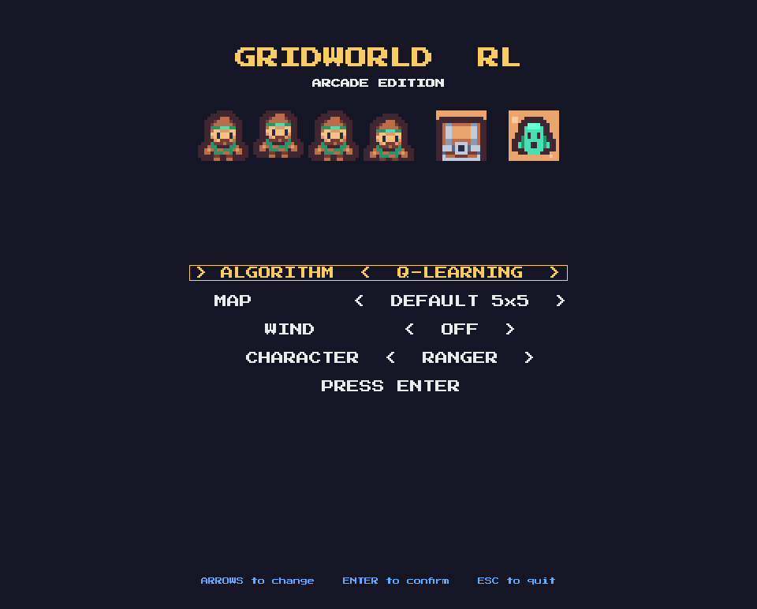 | 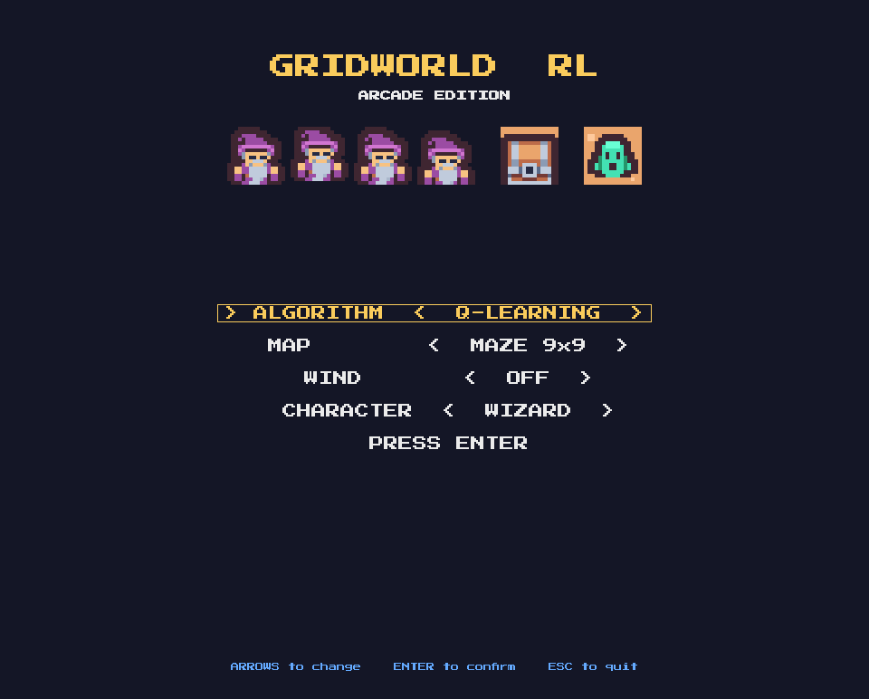 |

| Stochastic wind on | Value Iteration selected |
|:-:|:-:|
|  | 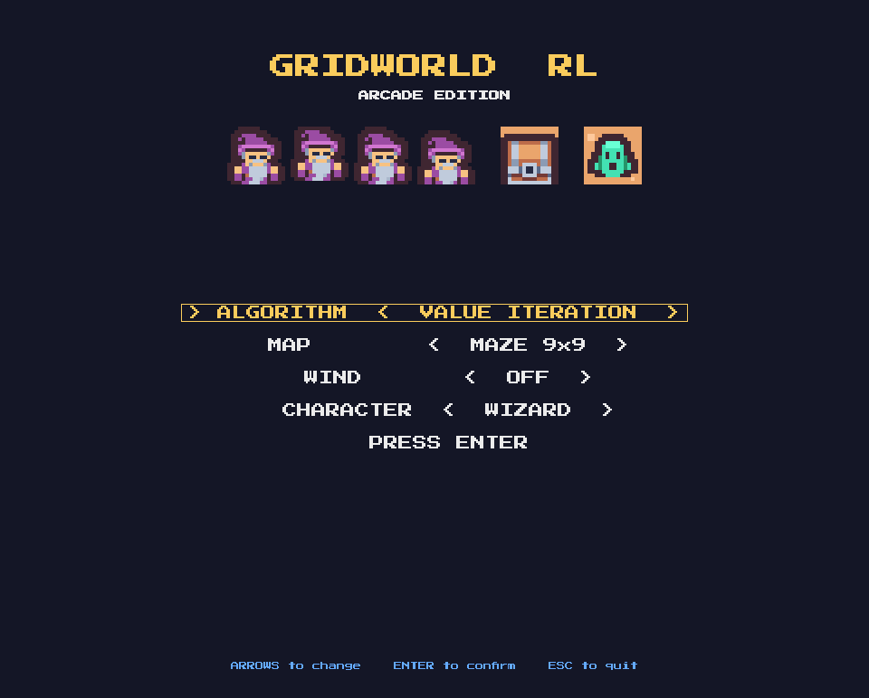 |

| Training: `DEFAULT 5x5` | Training: `OPEN 7x7` |
|:-:|:-:|
| 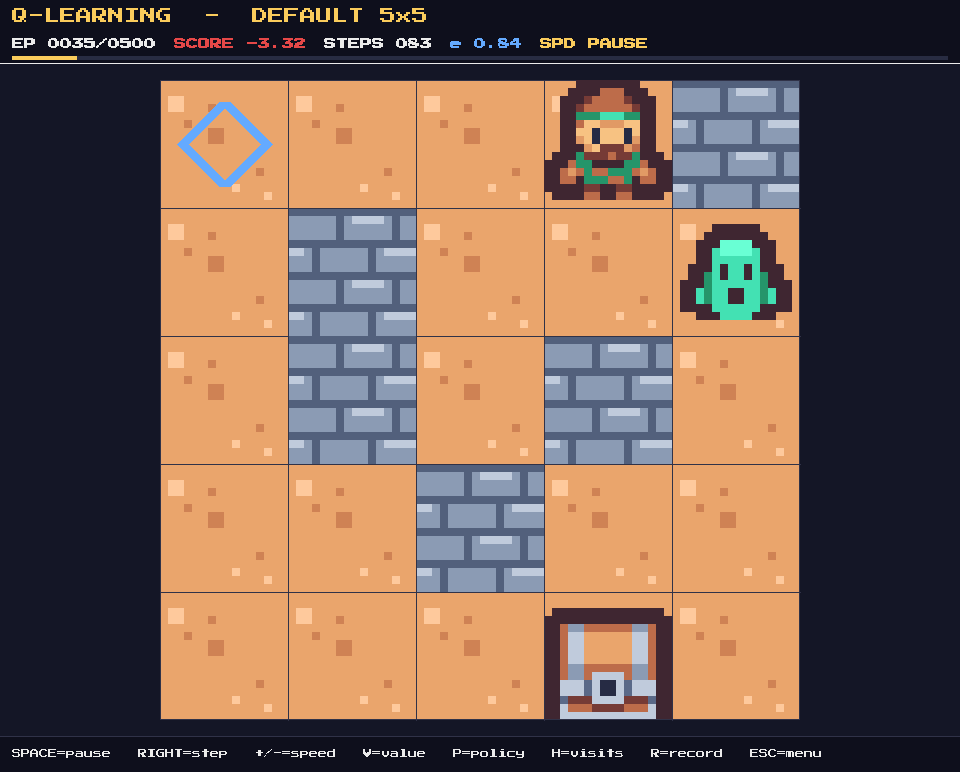 | 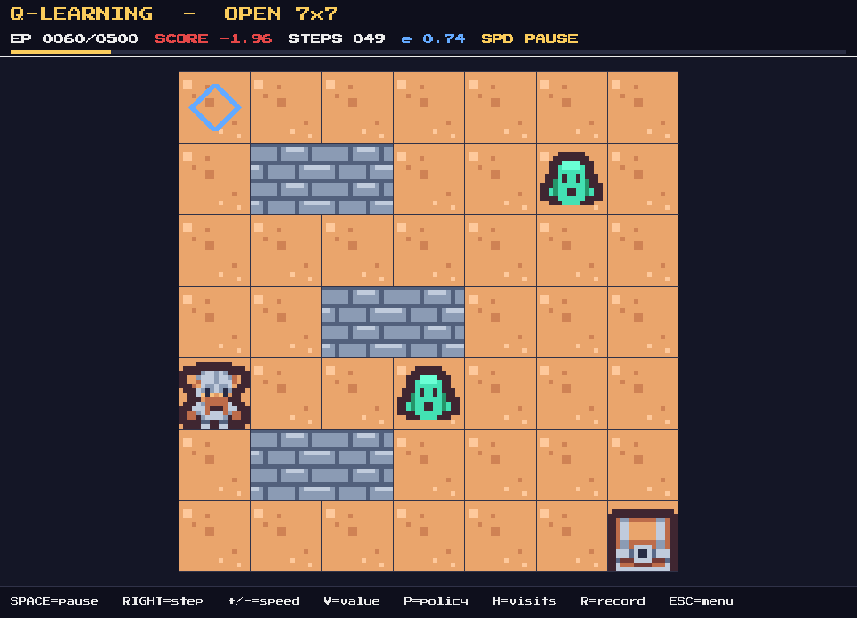 |

| Training: `MAZE 9x9` with V / P / H overlays | Training: `GAUNTLET 6x10` |
|:-:|:-:|
| 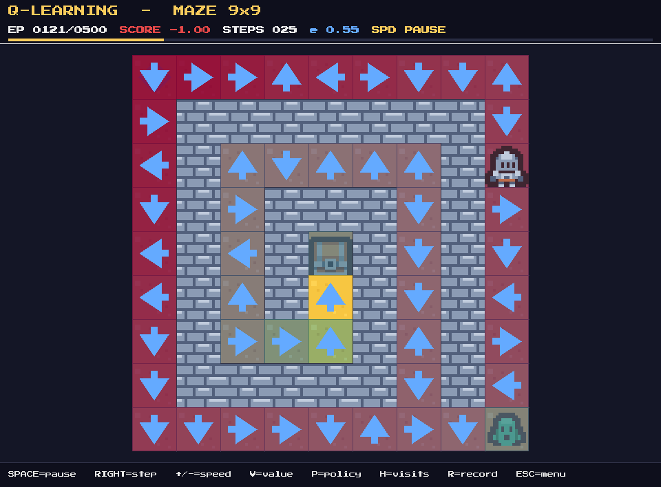 | 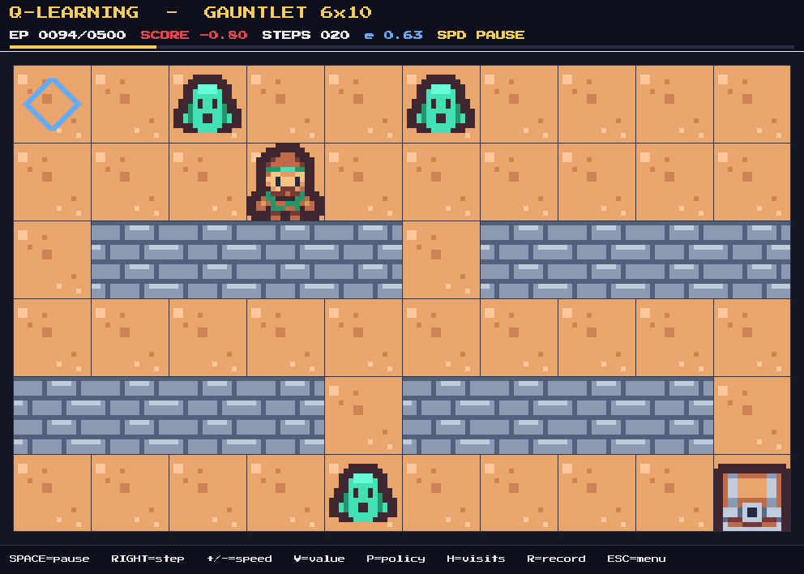 |

| Greedy playback (maze, mid-run) | Greedy playback (goal) |
|:-:|:-:|
| 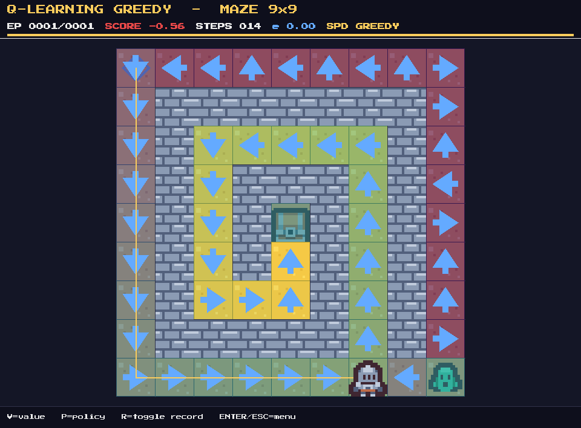 | 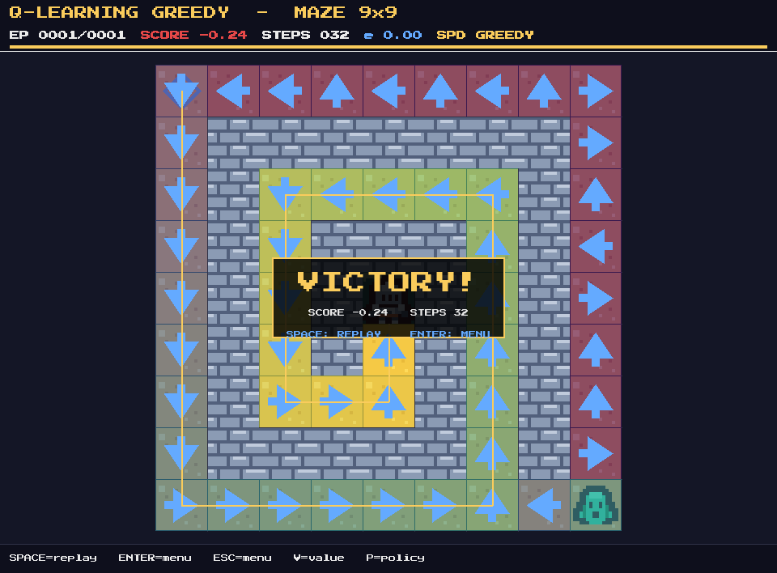 |

| Value Iteration greedy playback | Full greedy maze episode (GIF) |
|:-:|:-:|
| 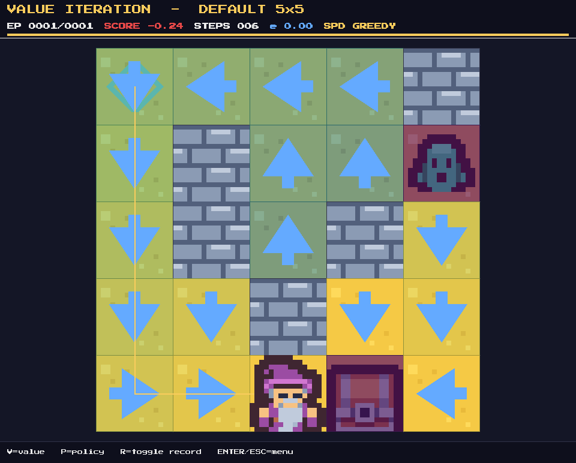 | 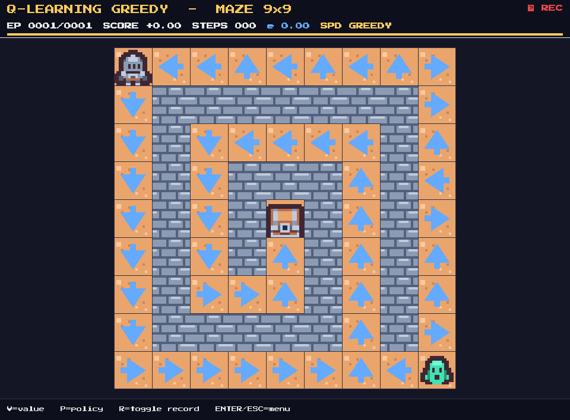 |

Regenerate these assets after UI or map changes:

```bash
./.venv/bin/python scripts/capture_doc_screenshots.py
```

Launch:

```bash
./.venv/bin/python main_ui.py
```

### Controls

| Key | Action |
|-----|--------|
| Arrow keys | Navigate the menu / adjust value |
| Enter, Space | Confirm / start |
| Esc | Back to menu (from a scene) / quit (from menu) |
| Space | Pause / resume training |
| Right arrow | Step once (when paused) |
| `+` / `-` | Cycle speed (1x → 2x → 4x → 8x → 16x → TURBO) |
| `V` | Toggle V(s) heatmap overlay |
| `P` | Toggle greedy policy arrows |
| `H` | Toggle visit-count heatmap |
| `R` | Start / stop manual GIF recording |
| `Space` (after playback ends) | Replay the same episode |
| `Enter` (after playback ends) | Return to the main menu |

### Maps

Four built-in layouts in the menu: `DEFAULT 5x5`, `OPEN 7x7`, `MAZE 9x9`, `GAUNTLET 6x10`. Custom layouts can be added to `src/ui/scenes.py::DEFAULT_MAPS`.

### Characters

Pick your hero on the title screen (`CHARACTER` row). Four archetypes drawn from the Tiny Dungeon pack: `RANGER` (green cloak, default), `KNIGHT` (silver armor), `WIZARD` (purple robe), `VIKING` (horned helm). The preview band at the top updates live as you cycle through them. Add your own by editing `CHARACTERS` in `src/ui/assets.py`.

### Auto-saved artifacts

Each run of `main_ui.py` creates a fresh `output/runs/<timestamp>_ui/` directory. When you finish a playback, an `episode.gif` of the greedy run is saved there automatically. Hitting `R` during a scene starts a manual recording saved as `manual_recording.gif`.

---

## Headless run (for the report / figures)

```bash
./.venv/bin/python main.py                                    # full pipeline
./.venv/bin/python main.py --episodes 200 --seed 0             # quick sanity
./.venv/bin/python main.py --stochastic --run-name windy       # stochastic world
./.venv/bin/python main.py --gamma 0.9 --run-name low-gamma    # sweep tag
```

This runs:

- Value Iteration on the known MDP (planning)
- Q-learning training (learning)
- Gamma comparison and exploration comparison sweeps
- Saves plots, `config.yaml`, and `metrics.json` into a new run dir

### CLI options

Run `--help` for the full list. Main options:

- `--stochastic`, `--wind-prob`
- `--gamma`, `--theta`
- `--episodes`, `--max-steps`, `--alpha`
- `--epsilon`, `--epsilon-decay`, `--epsilon-min`
- `--seed`
- `--output-dir` (default: `output/`)
- `--run-name` (slug appended to the run directory)

---

## Output structure

All runs are written under `output/runs/<YYYY-MM-DD_HH-MM-SS>_<slug>/`:

```
output/
  latest -> runs/2026-04-21_14-32-05_default   # symlink to the most recent run
  runs/
    2026-04-21_14-32-05_default/
      config.yaml              # hyperparameters, seed, env metadata
      metrics.json             # episode_rewards, epsilons, deltas, returns, sweeps
      vi/
        value_map.png
        policy.png
        trajectory.png
        convergence.png
      ql/
        value_map.png
        policy.png
        trajectory.png
        learning_curve.png
      comparisons/
        vi_vs_ql_rewards.png
        gamma_comparison.png
        exploration_comparison.png
      episode.gif              # produced by the UI if run via main_ui.py
```

This layout replaces the old flat `output/vi_*.png` scheme — experiments no longer overwrite each other, and every figure ships next to its config/metrics so results are reproducible.

---

## The environment (MDP)

Grid cells, symbols:

- `S` — start
- `G` — goal (terminal, reward `+1.0`)
- `T` — trap (terminal, reward `-1.0`)
- `#` — wall (blocked)
- `.` — empty (step cost `-0.04`)

Actions: `UP`, `DOWN`, `LEFT`, `RIGHT`.

Transitions are **deterministic** by default. With `--stochastic` the intended direction succeeds with probability `wind_prob`; perpendicular directions share the remainder. Value Iteration uses `GridWorld.get_transitions(state, action)` to enumerate all `(p, s', r, done)` outcomes.

---

## Algorithms

### Value Iteration (planning) — `src/value_iteration.py`

$$V(s) \leftarrow \max_a \sum_{s'} T(s,a,s')\big[R(s,a,s') + \gamma V(s')\big]$$

Produces `V(s)`, greedy policy, and a convergence curve.

### Q-learning (learning) — `src/q_learning.py`

$$Q(s,a) \leftarrow Q(s,a) + \alpha\big[r + \gamma \max_{a'} Q(s',a') - Q(s,a)\big]$$

Features: ε-greedy, ε decay, metrics (reward / steps / ε per episode).

The agent exposes both a batch `train(...)` API and a `train_stream(...)` **generator** that yields a `StepEvent` after every TD update. The arcade UI consumes the generator to animate training step-by-step; consuming the generator fully is byte-identical to calling `train(...)`.

---

## Assets and credits

See [assets/README.md](assets/README.md). TL;DR:

- Sprites: **Kenney Tiny Dungeon** (CC0) via <https://kenney.nl/assets/tiny-dungeon>
- Font: **Press Start 2P** (OFL) via Google Fonts
- Sound effects: synthesized with NumPy (public domain along with the rest of the project)

All assets are either CC0 or OFL, so no attribution is required — this list is here for transparency.

---

## Roadmap

Ideas that are intentionally **out of scope** for this milestone live in [ROADMAP.md](ROADMAP.md) — new algorithms (SARSA, Double Q, Policy Iteration), procedural maze generator, multi-seed confidence bands, HTML reports, human-playable mode, and more.

---

## Notes on headless execution (Matplotlib)

`main.py` forces the non-interactive backend (`Agg`) and sets cache directories under `output/` to avoid permission issues in restricted environments.
